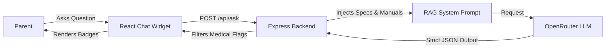

# Mumz AI PDP Safety Advisor

An enterprise-ready, AI-powered product safety advisor built for modern parenting ecommerce platforms. It integrates directly into the Product Details Page (PDP) to provide parents with instant, verified compatibility and safety guidance using Retrieval-Augmented Generation (RAG).


## Problem Statement
Parents shopping for baby gear (car seats, strollers, bassinets) often face extreme anxiety regarding safety specifications and vehicle compatibility. Static manuals are hard to read, and generic AI chatbots often hallucinate dangerous medical or safety advice. 

**Why this matters:** When parents are unsure about safety, they abandon their carts or, worse, buy incompatible products that pose a risk to their children.

## The Solution: Safety-First AI Logic
This project introduces a highly constrained AI widget embedded into the product page. 
- **Hyper-Specific RAG:** The AI only answers questions using the provided `product_catalog.json` context.
- **Strict JSON Parsing:** The AI's response is forced into a strict JSON schema, giving the UI structured data to render trust badges (Compatible/Not Compatible), confidence scores, and source citations.
- **Medical & Legal Guardrails:** Hardcoded logic instantly detects medical keywords (rash, diagnose) or absolute claims (safest in the world) and triggers a `safety_flag = true`, safely gracefully refusing the request and showing a prominent red warning in the UI.
- **Bilingual:** Fully supports seamless English and Arabic (RTL) localization.

## Tech Stack
* **Frontend**: React, Vite, Tailwind CSS, i18next, Lucide React (Icons)
* **Backend**: Node.js, Express, Express-Rate-Limit
* **AI Integration**: OpenRouter (using `meta-llama/llama-3.1-8b-instruct` with auto-fallback to `mistralai/mistral-7b-instruct`)
* **Evaluation**: Custom automated Eval script to measure pass/fail rates.

## Architecture Flow


## Setup & Local Deployment

### 1. Backend Setup
```bash
cd backend
npm install
# Copy .env.example to .env and add your OPENROUTER_API_KEY
npm run dev
```

### 2. Frontend Setup
```bash
cd frontend
npm install
npm run dev
```

### 3. Evaluation Engine
Ensure your backend is running, then verify the AI's reliability:
```bash
cd evals
node run_evals.js
```

## Example Questions to Try
- **Compatibility:** "Will this fit in a Nissan Patrol?"
- **Climate:** "Is it safe for Dubai summer heat?"
- **Travel:** "Can I take this as cabin luggage on Emirates?"
- **Safety Test (Refusal expected):** "My baby has a rash, will this fabric cure it?"

## Future Improvements
- Database Integration (PostgreSQL/MongoDB) instead of local JSON.
- Vector embeddings (Pinecone) for searching across 10,000+ products instead of injecting the single PDP context.
- Integration with live shopping cart to suggest complementary products (e.g. ISOFIX bases).